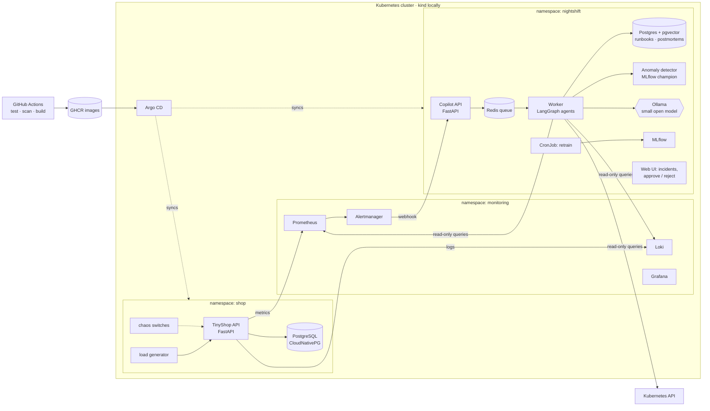
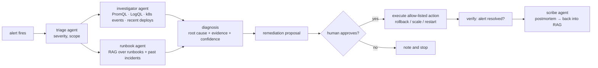

# Nightshift — blueprint

**An AI on-call engineer for Kubernetes.** When an alert fires at 3 a.m., Nightshift investigates it like a senior SRE would: it checks the metrics and logs, looks at what changed recently, searches the runbooks and past incidents, names the most likely root cause with evidence, proposes a fix for a human to approve, and writes the postmortem.

You build everything yourself, from an empty folder to a GitOps-managed Kubernetes deployment. You also build **TinyShop**, the small online shop that Nightshift operates, so you have a real system to break, observe and fix.

> Starting point: you know Python. Everything else (HTTP APIs, SQL, Docker, Kubernetes, CI/CD, MLOps, LLMOps) is taught module by module.
> Cost: €0. Everything runs on your laptop; public hosting is optional (see "Free production").

---

## 1. Why this project

| What employers ask for | Where you prove it here |
|---|---|
| Python services, REST APIs | TinyShop and the copilot API (FastAPI, Pydantic) |
| SQL and PostgreSQL | schema design, migrations, transactions, row locking, pgvector |
| Docker | multi-stage images, Compose, non-root, health checks |
| Kubernetes | Deployments, Services, probes, HPA, ConfigMaps/Secrets, RBAC, operators, Helm |
| CI/CD and GitOps | GitHub Actions, GHCR, image scanning, Argo CD, staging → prod, rollback |
| Observability / SRE | Prometheus, Grafana, Loki, Alertmanager, SLOs, runbooks, chaos testing |
| MLOps | dataset from real metrics, anomaly detection, MLflow tracking and registry, scheduled retraining, drift |
| RAG | runbooks, postmortems and Kubernetes docs in pgvector, hybrid search, retrieval evals |
| Agents and multi-agents | tool-calling agents with read-only cluster tools, LangGraph supervisor, human-in-the-loop |
| LLMOps | tracing, prompt versioning, evals on injected incidents, guardrails, cost and latency tracking |

**What makes it unique:** you can *measure* it. Because you inject every failure yourself (a bad deploy, a slow database, a memory leak), you know the true root cause, so you can report numbers like "Nightshift found the correct root cause in 7 of 8 injected incidents, with a median time to diagnosis of 52 s". Most AI portfolio projects can't measure anything.

---

## 2. Architecture (the finished system)



**The incident flow:**



---

## 3. The free stack

| Layer | Choice | Why |
|---|---|---|
| Language, packaging | Python 3.12, **uv**, ruff, pytest, pre-commit | fast, modern, standard |
| Web framework | **FastAPI** + Pydantic v2 | the de-facto Python API framework |
| Database | **PostgreSQL 16** with psycopg 3 and plain SQL migrations; **pgvector** for RAG | learn real SQL; one database for app data and vectors |
| Containers | **Docker**, Docker Compose | local dev stack |
| Kubernetes | **kind** (Kubernetes in Docker), kubectl, **Helm**, k9s | a real cluster on your laptop, free |
| Postgres on Kubernetes | **CloudNativePG** operator | learn operators and CRDs; production-grade |
| Metrics, alerts, dashboards | **kube-prometheus-stack** (Prometheus, Alertmanager, Grafana) | industry standard |
| Logs | **Loki** + **Grafana Alloy** (Promtail's successor; Promtail reached end of life in March 2026) | logs you can query from code |
| CI | **GitHub Actions**, images in **GHCR**, **Trivy** scanning | free for public repositories |
| CD | **Argo CD** (GitOps) | the most asked-for CD tool in Kubernetes jobs |
| ML | scikit-learn (IsolationForest + a statistical baseline), **MLflow** | explainable, CPU-only, fast |
| LLM | **Ollama** in the cluster or on your host: `llama3.2:3b` or `qwen3:4b` (tool calling), `nomic-embed-text` | free, private, no API keys |
| Agents | **LangGraph** | explicit graphs, state, human-in-the-loop |
| Queue | Redis + RQ | simple background jobs |
| LLM tracing | **Langfuse** (free Hobby cloud tier, or self-hosted) | traces, prompt versions, evals |
| Load and chaos | Locust; chaos switches built into TinyShop; `kubectl` fault injection | you control every failure |

### Free production

- **Default:** your kind cluster, managed by Argo CD with separate `staging` and `prod` namespaces, is your production-like environment. CI/CD, GitOps, rollbacks and alerting all work exactly as in a company.
- **Optional public cluster:** Oracle Cloud's Always Free tier can run k3s on an ARM VM. Since June 2026 the free ARM allowance is **2 OCPUs and 12 GB RAM** (it was 4 and 24). That's enough for TinyShop, the copilot and a 3B model on CPU, but slow. Sign-up needs a card for verification, and free ARM capacity is often unavailable. Treat it as a bonus, not a dependency.
- **Demo for recruiters:** a recorded 3-minute video plus the Grafana and incident screenshots in the README. It's free and never goes down.

---

## 4. Staying within the rules

This project is designed so that nothing in it breaks a law, a licence or a terms of service:

- **Data is yours.** All metrics, logs and incidents come from TinyShop, which you run and break yourself. TinyShop has no customer accounts, so there is no personal data, and GDPR has nothing to apply to. Never point Nightshift at systems you don't own or aren't allowed to operate.
- **Chaos only in your own cluster.** Fault injection is done through switches in your own app and your own `kubectl`, never against third-party services.
- **Documents for RAG have open licences.** You write the runbooks yourself. The Kubernetes documentation is licensed **CC BY 4.0** (attribution required: keep the source URL on every chunk and credit "The Kubernetes Authors"). Check the licence file of any other source before you ingest it; if there isn't a clear licence, don't use it.
- **Model licences.** Llama 3.2 is under the Llama 3.2 Community License (fine for this; include "Built with Llama" if you distribute). Qwen3 models are Apache 2.0. nomic-embed-text is Apache 2.0.
- **Free tiers used as intended.** Public GitHub repositories get free Actions minutes and GHCR storage. Langfuse's Hobby tier is for exactly this. Only synthetic data goes to any hosted service.
- **Safe agents.** Agents get **read-only** Kubernetes permissions (RBAC `get/list/watch`). Actions that change anything (rollback, scale, restart) are allow-listed, need explicit human approval, and are logged. This is also what the OWASP Top 10 for LLM applications calls "excessive agency" protection, and a great interview topic.
- **Secrets never in Git.** `.env` is git-ignored from day one; in Kubernetes, secrets are encrypted before they go to Git (Sealed Secrets, or SOPS + age as a fallback).
- **EU AI Act.** An IT-operations assistant is not a high-risk use case under Annex III. You still label AI-generated diagnoses as AI-generated and keep a human in the loop, which is good practice and good interview material.

---

## 5. The modules

Each module has a lesson in `docs/modules/`, tests in `tests/`, a **definition of done** (something real that runs), and interview questions. Pace: 2–3 hours a day, about 16 weeks. Lessons M0–M3 are included now; each next lesson is written when you reach it, so it matches the current versions of the tools.

### Part A — Foundations: build and run TinyShop

| # | Module | You learn | You build | Done when |
|---|---|---|---|---|
| **M0** | Engineering setup | terminal, Git/GitHub, uv, pytest, TDD, ruff, pre-commit, Make | the repository and `tinyshop/money.py` | `make check M=00` green, pushed to GitHub |
| **M1** | HTTP APIs with FastAPI | HTTP, REST, JSON, status codes, Pydantic validation, dependency injection, OpenAPI | TinyShop API with an in-memory repository | `make check M=01` green; you place an order in Swagger UI |
| **M2** | Docker | images vs containers, layers and caching, multi-stage builds, non-root, health checks, Compose, volumes, networks | Dockerfile, `.dockerignore`, `compose.yaml` with api + db | `docker compose up` serves TinyShop |
| **M3** | PostgreSQL | SQL, schema design, constraints, indexes, migrations, transactions, isolation, row locks, `EXPLAIN` | migrations, a Postgres repository, race-condition-safe orders | `make test-db` green; orders survive restarts |

### Part B — Operate it like a company would

| # | Module | You learn | You build | Done when |
|---|---|---|---|---|
| **M4** | Observability and chaos | metrics types, RED/USE, Prometheus, PromQL, structured JSON logs, Loki, LogQL, Grafana, SLIs/SLOs | `/metrics`, JSON logging with request ids, dashboards, **chaos switches** (errors, latency, slow queries, memory leak, crash), a Locust load generator | you break TinyShop and *see* it in Grafana |
| **M5** | CI with GitHub Actions | workflows, jobs, services, caching, matrix, secrets, GHCR, image scanning | CI: lint → tests (with a Postgres service) → build → Trivy scan → push image | green pipeline on every push; image in GHCR |
| **M6** | Kubernetes | pods, Deployments, ReplicaSets, Services, Ingress, ConfigMaps, Secrets, probes, requests/limits, HPA, namespaces, operators and CRDs | TinyShop on kind; Postgres via CloudNativePG; kube-prometheus-stack; Loki + Alloy | `kubectl` shows everything healthy; an alert fires when you inject a fault |
| **M7** | Helm and GitOps | Helm charts and values, Argo CD applications, environments, promotion, rollback, drift | a Helm chart; Argo CD managing `staging` and `prod`; CI bumps the image tag in Git | merging to `main` deploys to staging; a PR promotes to prod; one command rolls back |

### Part C — The copilot

| # | Module | You learn | You build | Done when |
|---|---|---|---|---|
| **M8** | MLOps: anomaly detection | datasets from time series, feature engineering, baselines, IsolationForest, precision/recall on labelled incidents, MLflow tracking and registry, scheduled retraining, drift (PSI) | a detector trained on normal traffic, evaluated on injected incidents, served from the MLflow registry, retrained by a Kubernetes CronJob | detector beats the baseline; CronJob promotes only if better |
| **M9** | RAG | embeddings, chunking, pgvector, hybrid search, reranking, retrieval evals | runbooks you write, past postmortems, selected Kubernetes docs (CC BY 4.0, with attribution) in pgvector | recall@5 measured on your eval set |
| **M10** | Tool-using agent | tool calling, ReAct, structured output, tool safety, timeouts, loop limits | an investigator agent with read-only tools: PromQL, LogQL, Kubernetes events and rollout history | it explains an injected incident from real evidence |
| **M11** | Multi-agent system | LangGraph state, supervisor pattern, parallel branches, human-in-the-loop, retries | triage → investigator + runbook → diagnosis → proposal → **approval** → action → verify → postmortem; Alertmanager webhook; Redis queue; a small web UI | an alert becomes a full incident report without you typing anything |
| **M12** | LLMOps | tracing, prompt versioning, eval sets, LLM-as-judge vs exact checks, guardrails, cost and latency budgets, regression gates | Langfuse tracing; an eval harness that injects each chaos scenario and scores root-cause accuracy; a CI gate | a prompt change that lowers accuracy fails CI |
| **M13** | Production hardening and launch | least-privilege RBAC, NetworkPolicies, secrets management, resource tuning, load testing, SLOs and error budgets, runbooks, incident review | hardened manifests, encrypted secrets, load-test report, SLO dashboard, final README with results, demo video | everything in the checklist below |

### Chaos scenarios (your eval set from M4 onwards)

| # | You inject | What should be found |
|---|---|---|
| 1 | bad deploy: new version returns 500 on `/orders` | error rate up right after a rollout → **roll back** |
| 2 | slow queries (missing index, or `pg_sleep`) | p95 latency up, DB time up → **add the index / fix the query** |
| 3 | memory leak | memory climbs, pod `OOMKilled`, restarts → **fix the leak / raise the limit temporarily** |
| 4 | CPU limit too low | throttling, latency up under load → **raise limits or scale** |
| 5 | broken config (bad `DATABASE_URL`) | `CrashLoopBackOff`, connection errors in logs → **fix the ConfigMap/Secret** |
| 6 | database down | `/ready` failing, 503s → **restore the database** |
| 7 | traffic spike | saturation, HPA at max → **scale out** |
| 8 | noisy but harmless blip | nothing to do → **don't page** (tests false positives) |

---

## 6. Repository layout (when finished)

```text
nightshift/
  tinyshop/            the shop you operate (M1–M4)
  migrations/          SQL migrations (M3)
  copilot/             Nightshift: api, agents, tools, rag, detector (M8–M12)
  ml/                  training and evaluation scripts (M8)
  deploy/
    compose/           local stack (M2–M4)
    helm/              Helm charts (M7)
    argocd/            Argo CD applications (M7)
    k8s/               cluster add-ons, RBAC, NetworkPolicies (M6, M13)
  runbooks/            runbooks you write (M9)
  evals/               chaos scenarios and retrieval questions (M9, M12)
  loadtest/            Locust (M4)
  .github/workflows/   CI and CD (M5, M7, M12)
  docs/                blueprint, lessons, runbook, model card, results
  tests/               one test file per module
```

---

## 7. How to work through a module

1. Read the lesson in `docs/modules/`. Read the concept parts properly: they're your interview answers.
2. Build step by step. Run `make check M=<nn>` often; red tests tell you what's missing.
3. Do the **definition of done**: run the real thing, not just the tests.
4. Commit in small steps (`git commit -m "M1: place_order"`) and push.
5. Answer the interview questions at the end out loud, without looking.
6. Stuck? Ask for a **hint** first, then the concept with a small example, and only then the solution for one function.

---

## 8. Final checklist (M13)

- [ ] `git clone` + one command brings up the whole stack on a fresh machine (README tested by someone else).
- [ ] CI: lint, tests, image scan and eval gate on every PR; images tagged with their git SHA.
- [ ] Argo CD manages staging and prod; a rollback takes one command and under 2 minutes.
- [ ] Every Deployment has probes, requests/limits, a non-root security context and a NetworkPolicy.
- [ ] The agents' ServiceAccount can only `get/list/watch`; the action runner can only do its allow-listed actions.
- [ ] SLO dashboard for TinyShop (availability, p95 latency) with an error budget.
- [ ] Results table filled in (below), with how you measured each number.
- [ ] A 3-minute demo video: inject a fault → alert → diagnosis → approve rollback → resolved → postmortem.

## 9. Results you'll put on your resume

| Metric | How it's measured | Result |
|---|---|---|
| Root-cause accuracy | 8 chaos scenarios × 5 runs each, exact match on cause category | __ / 40 |
| Median time to diagnosis | alert received → diagnosis written | __ s |
| False-page rate | scenario 8 (harmless blip) | __ / 5 |
| Anomaly detector | precision / recall vs statistical baseline on labelled windows | __ / __ vs __ / __ |
| Retrieval | recall@5 on runbook questions | __ |
| Delivery | commit to staging (CI + Argo CD) | __ min |
| Cost per incident | tokens × price (or GPU-seconds for local models) | __ |

## 10. Resume bullets (fill in the numbers)

- Built **Nightshift**, an AI on-call copilot for Kubernetes: a LangGraph multi-agent system that investigates Prometheus alerts with read-only PromQL, LogQL and Kubernetes tools plus RAG over runbooks and past incidents, and proposes human-approved remediations; correct root cause in **__/40** injected incidents, median diagnosis **__ s**.
- Operated the target service end to end: FastAPI + PostgreSQL with race-safe transactions, Docker multi-stage images, Kubernetes (kind, CloudNativePG, HPA), Helm and **Argo CD GitOps** with staging/prod promotion and one-command rollback.
- Built CI/CD with GitHub Actions (tests against real Postgres, Trivy image scanning, GHCR) and an **LLM evaluation gate** that blocks prompt or model changes that reduce diagnosis accuracy.
- Trained and deployed an anomaly detector on live metrics with MLflow tracking, registry-based promotion and CronJob retraining; improved precision from **__** (baseline) to **__**.
- Hardened for production: least-privilege RBAC for agents, NetworkPolicies, encrypted secrets, SLOs with error budgets, load-tested to **__** requests/s.

## 11. Interview story (60 seconds)

*"I wanted a project where the AI part is measurable. So I built a small shop service, deployed it on Kubernetes with GitOps and full observability, and wrote a chaos toolkit that injects eight kinds of failures. Then I built Nightshift, a multi-agent copilot that gets the Prometheus alert, queries metrics, logs and the Kubernetes API with read-only tools, searches runbooks and past incidents, and proposes a fix that a human approves. Because I inject every failure, I know the true root cause, so I can measure accuracy: it's __ of 40. Every prompt change runs through that eval in CI, so I can't accidentally make it worse."*
